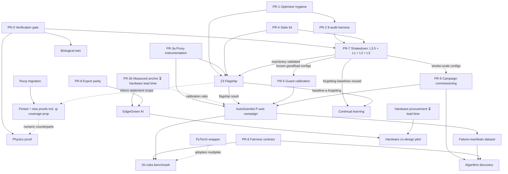

# RESEARCH3 — Research Items

> **Deliberately unordered catalog, ordered plan.** Each entry is self-contained: question, falsifiable hypothesis, design, controls, targets, statistics/budget, deliverables, stretch goals, substrate, risks. Prioritization lives in the planning sections below (prerequisites, dependency graph, critical paths), and every plan executes under the shared **Execution Protocol**.

---

## Program Identity

**Verification-first, negative results first.** This is the differentiator, not support structure: gates that fail get published with autopsies (the deep-EqProp boundary analysis is the institutional proof), pre-registration precedes comparison, nulls are first-class results, and every formal claim has an executable numeric counterpart. Competitors can copy individual experiments; they cannot copy this culture without adopting it. Every item below inherits this stance by default.

---

## Z3 Fixed Weights (Level 4)

**Question:** *Can frozen $\theta$ solve multiple tasks via $\psi$-mediated rule selection?* No direct analogue exists in the literature (see the ICL-bridge item for the nearest competitor and why it differs). Tests the thesis that elevating the computational rule to a dynamical variable (the P-axis) yields a qualitatively different capability.

**Framing:** the Zuse analogy (`Z3.md`) carries any introduction: fixed relays = $\theta$, punched tape = $\psi$. Switching must emerge from differentiable arithmetic masking,
$$T_t = \sum_k g_k(\psi_t)\, T_k, \qquad g_k(\psi_t) = \mathrm{softmax}(\text{controller}(\psi_t, x_t)),$$
never from weight edits.

**Falsifiable hypothesis:** after meta-training, ψ-only adaptation reaches ≥95% accuracy on all three tasks within ≤20% of the gradient steps fine-tuning needs, at exactly $\Delta\theta = 0$, while fine-tuning loses ≥10 points on previously learned tasks.

**Design (current defaults → upgrades):**
1. Current implementation: `Z3Model` (8 operators, `operator_dim=input_dim=32`, `controller_hidden=128`), meta-train 50 epochs joint over all 3 tasks (Adam lr $10^{-3}$), freeze θ (`requires_grad_(False)`), reset ψ per task (zero controller state + logits), adapt ψ online 20 epochs on fresh batches, eval hard-selection over 20 batches. Upgrade path: sweep `seq_len ∈ {10, 25, 50}`, `input_dim ∈ {32, 64}`, meta-train epochs ∈ {50, 200}; report sensitivity.
2. Tasks stay disjoint-structured: `Parity` (order-$n$ counting mod 2), `LastSymbol` (position-selective readout), `Threshold` (accumulation + comparison). No single operator solves all three; switching is mandatory.
3. Library ablation axis: full 8 operators (`Identity, Threshold, Accumulate, LastSymbol, Parity, SparseTopKRoute, SignFlip, Delay`) vs. minimal 3-operator subset vs. shuffled-operator assignment. Library size vs. adaptation speed is itself a finding.
4. Adaptation schedule study: Gumbel-Softmax temperature annealing (constant 1.0 today) vs. linear decay $1.0 \to 0.1$ vs. cyclic re-annealing per task switch.

**Metrics:** steps-to-criterion (first 100-step window ≥98% accuracy); FLOPs + wall-clock of ψ-only adaptation vs. θ-updates; operator-diversity entropy $H(g_k)$ at convergence (collapse detection: $H < \log 2$ flags single-operator reliance); exact-zero $\Delta\theta$ check ($<10^{-6}$ tolerance, `theta_invariant` flag) — headline integrity claim, reported per seed.

**Baselines:** (a) fine-tune θ, same step budget — measures the forgetting tax; (b) random-ψ init — isolates what meta-training bought; (c) frozen θ + frozen ψ — floor control proving the trunk alone can't solve tasks; (d) **new:** soft-mixture-at-eval (no hard argmax) — quantifies how much performance depends on discretization.

**Statistics:** ≥5 seeds; mean ± bootstrap 95% CI; paired vs. baseline (a) on identical task orderings; thresholds pre-registered before any full run.

**Deliverables:** Fig. 1 accuracy-vs-steps curves (Z3 vs. all baselines); Fig. 2 forgetting matrix (task × time under each method); Table 1 Δθ audit + diversity entropy per seed.

**Stretch:** >3 tasks (add SignFlip-, Delay-, TopK-defined tasks); *compositional* switching (task = ordered pair of operators); Hebbian/local controller updates replacing backprop-through-ψ (fully local Z3 — closes the loop with the locality thesis); measured Joules via `computronium/core/profiling.py` instead of FLOP proxies.

**Substrate:** `computronium/experiments/joint/z3_fixed_weights.py`, `computronium/core/plasticity/rule_state.py`; run via `comp benchmark run --suite z3_fixed_weights --seeds 5 --device cuda`.

**Risks & mitigations:** soft-to-hard selection gap (mitigate with temperature annealing + straight-through estimators); controller collapse onto one operator (entropy monitoring + entropy bonus term as fallback); optimizer state staleness across phases (rebuild Adam between meta-train and ψ-adaptation — current code carries optimizer state over θ's momentum buffers).

---

## Z3 ↔ In-Context Learning Bridge

**Question:** frozen-weights task switching looks superficially like transformer in-context learning, hypernetworks, and visual prompt tuning. Is ψ-mediated rule selection the same phenomenon, a strict generalization, or something else?

**Why it matters:** the flagship Z3 claim ("no analogue in literature") is only credible if the nearest neighbours are named and differentiated experimentally, not rhetorically. This item converts a positioning weakness into a contribution.

**Design:**
1. Implement three comparator mechanisms on identical task suites (the Z3 triple + switching stream): (a) a small transformer conditioned on task demonstrations (ICL), (b) a hypernetwork generating layer weights from a task embedding, (c) prompt-conditioned frozen MLP (prompt tuning).
2. Hold data, budget, and evaluation fixed; vary mechanism only.
3. Measure: adaptation data efficiency (demonstrations needed vs. gradient steps needed), parameter-update requirement (all comparators except ICL require some training; ICL requires none but pays attention-compute per query), OOD task generalization (tasks outside the meta-training distribution).

**Scale-matching rule (pre-committed here, recorded in PR-6):** comparator qualification is performance-gated, not parameter-matched — each mechanism must reach ≥95% on each task individually (no switching) within the E-4 equal tuning budget, at whatever architecture scale achieves it; only qualified mechanisms enter the switching comparison. If the transformer cannot qualify, the head-to-head is reported as invalid-with-autopsy rather than silently compared. Parameter count and adaptation FLOPs are reported per arm so residual scale asymmetry stays visible.

**Discriminating predictions:** Z3's ψ state persists across queries within a task without re-computation per token (unlike ICL); ψ capacity scales with operator-library size, not sequence length; switching latency is constant rather than growing with context.

**Deliverable:** position table + one head-to-head figure (accuracy vs. adaptation cost, four mechanisms).

**Risks:** scope creep — cap at one architecture per comparator family.

---

## Adaptation Efficiency Comparison (Level 1)

**Question:** *does plasticity adapt faster than Null?* The conventional workhorse: Null vs. Routing vs. FastWeight on a switching distribution.

**Hypothesis:** FastWeight cuts post-switch re-adaptation steps by ≥30% vs. Null at equal accuracy; Routing wins when the switch is categorical (identity change) rather than parametric.

**Design:**
1. `create_switching_task` stream with swept switch period ∈ {500, 1000, 2000} steps and task-gap magnitude ∈ {small, large}; these hyperparameters otherwise silently dominate results.
2. Coordinates spanning M ∈ {Null, Routing, FastWeight} at matched trainable-parameter counts (`PlasticityModulatedModel`, `CompositeState`).
3. Epochs-per-phase 50, batch 64, ≥5 seeds (suite reports mean ± std into `adaptation_efficiency_results.json`).

**Metrics:** adaptation half-life per switch (steps to recover 90% of pre-switch accuracy), final accuracy, plasticity primitive parsed from coordinate string, cumulative adaptation compute.

**Deliverables:** Pareto plot (adaptation time vs. compute cost); switch-period sensitivity curve — robustness of the conclusion to the experimental knob nobody reports.

**Stretch:** overlay RuleState as fourth arm once Z3 stabilizes; recast as *anytime adaptation* (accuracy as function of post-switch budget).

**Substrate:** `computronium/experiments/joint/adaptation_efficiency.py`; `comp benchmark run --suite adaptation_efficiency`.

**Risks:** confirmatory rather than novel — its value is as the guaranteed-clean fallback figure and as calibration for L3.5/L4 claims.

---

## Compute Efficiency (Level 2) & Structural Robustness (Level 3)

Two implemented-but-unplanned suites complete the benchmark staircase below Z3; they anchor the resource-vector story empirically.

**L2 — Question:** *does routing reduce effective ops?* Mixture-of-experts synthetic (8 experts, 1 active): dense baseline vs. sparse-routed model. Metrics: active units, gate entropy, effective matmul FLOPs (`compute_efficiency.py`). Hypothesis: routing achieves ≥5× effective-FLOP reduction at <2-point accuracy loss, with gate entropy confirming specialization (not load collapse).

**L3 — Question:** *can the system recover after damage?* Lesion suite: zeroed weights, removed nodes, dead channels, noisy memristive states; compare Null vs. Routing vs. SubstrateCoupled (`structural_robustness.py`). Metrics: accuracy-retention-vs-lesion-fraction curves, recovery steps if plasticity is active during recovery. Hypothesis: SubstrateCoupled degrades most gracefully under memristive noise specifically (its native failure mode), validating the substrate-aware ontology claim.

**Shared design:** matched parameter counts; ≥5 seeds; lesion/damage fractions swept {10, 25, 50, 75}%; identical backbone across arms.

**Deliverables:** two figures slotting directly beneath the Z3 result in the benchmark paper; L2's effective-FLOPs metric feeds the $\mathcal{C}$ vector definition used everywhere else.

**Risks:** both toy tasks have low ceilings; treat as instrumentation-validation layers for the resource vector, not headline results.

---

## Algorithm Migration (Level 3.5)

**Question:** *can ψ switch strategy without θ update?* The direct precursor to Z3: migration between exactly two strategies, A0 (classify by cumulative sum) → A1 (classify by last symbol), measuring time(A0→A1), energy(A0→A1), and enforcing $\|\theta_{after} - \theta_{before}\| = 0$ (`algorithm_migration.py`).

**Role:** Z3's minimal sibling. Runs first-in-catalog-order nowhere — it is simply the cheapest setting in which the ψ-switching machinery can be validated end-to-end, and its two-task version yields closed-form optimal switching policies that Z3's three-task setting does not.

**Hypothesis:** ψ-mediated migration beats re-training-from-A0-init on time-to-A1 by an order of magnitude at zero θ drift.

**Design:** sweep ψ-state dimensionality {32, 128, 512}; measure whether migration time scales with state size (it should, if ψ genuinely encodes strategy) or saturates immediately (suggesting it doesn't — diagnostic value either way).

**Deliverables:** migration-time table; the $\Delta\theta = 0$ audit reused verbatim in the Z3 paper.

---

## AutoScientist M-Axis Ablation Campaign

**Goal:** turn any single manual result into a frontier by sweeping the P-axis with the other five axes pinned.

**Design:**
1. Pin S/G/D/C/U at the flagship coordinate; sweep M ∈ {Null, Routing, FastWeight, RuleState}. One axis at a time — an ablation, not a search.
2. `AutoScientistCampaign.run_iteration` + `CampaignDatabase` + `CampaignCheckpointer` manage iterations, checkpoint/resume; wall-clock capped via campaign config `max_wall_hours`.
3. Per-coordinate `ResourceUsage` records aggregated post-hoc; dominance filtering never runs inline (avoids order-dependence).

**Output:** the Resource-Vector Pareto Frontier over
$$\mathcal{C} = (\text{compute}, \text{memory}, \text{energy}, \text{latency}, \text{plastic-state capacity})$$
(`frontier.py::ResourceUsage`). Deliverable figures: 2-D projections (accuracy-per-Joule, plastic-capacity-vs-forgetting) annotated with which M primitive owns each knee.

**Gate:** the flagship result sits on/near the front across seeds.

**Stretch:** two-axis sweeps (M × CreditAssignment) once single-axis frontier exists; the proposer's `ProposalObjective` non-accuracy ranking (bias-audited in `proposer.py`) can drive energy- or stability-first campaigns — a campaign whose objective is *not accuracy* is itself a demo no competing framework offers.

**Risks:** proxy metrics may not discriminate primitives at small scale (validate proxies against one measured workload first); campaign DB schema churn mid-campaign (freeze before launch).

---

## Runtime Verification Guard & Failure Manifesto

**Goal:** shift verification philosophy from offline "Proof" to online "Monitoring."

**Design:**
1. Elevate `StabilityMonitor` diagnostics — $\rho(J_F)$ via `spectral_radius_from_jacobian` (autograd eigvals; `JacobianAmplificationEstimator` for directional amplification), Lyapunov exponents, settling behavior (`computronium/core/stability/`) — into guards inside `AutoScientistCampaign.run_iteration`.
2. Policy: rollout exhibiting $\rho(J_F) > 1.0$ or non-decreasing free energy (EqProp coordinates) → kill pre-budget-burn, append structured record to the failure manifesto (`analysis/failure_manifesto.py`), mutate hyperparameters (contractive rescaling, temperature reset), retry same iteration.
3. Calibration pass: run guard against held-out known-good and known-bad configs; choose thresholds on ROC, not intuition. `_fast_proxy` vs. full-Jacobian estimator disagreement rate reported explicitly.

**Acceptance:** false-kill rate <5% on known-good set; unstable-coordinate kill rate >95%; guard overhead <10% of iteration wall-clock.

**Deliverables:** working guard; manifesto-as-dataset — "where does the joint system go unstable?" is a standalone empirical contribution about the P-axis's stability cost.

**Stretch:** manifest-derived *a priori* instability predictor (classify configs before running) feeding back into the proposer's acceptance sampling.

---

## Continual Learning Proof (Catastrophic Forgetting)

**Problem:** backprop + SGD overwrites old knowledge; replay buffers are the dominant patch.

**Hypothesis (falsifiable):** P-axis decoupling (ψ fast states vs. θ consolidation) matches-or-beats EWC on backward transfer without any replay buffer, on Split-MNIST.

**Design:**
1. Split-MNIST (5 binary tasks); arms: FastWeightPlasticity, ElasticConsolidationUpdate, backprop+SGD control, replay buffer baseline at matched memory. Task-free variant (no task boundaries signaled) as second protocol.
2. Backward transfer matrix after each boundary; memory footprint tracked explicitly (replay pays storage; ψ pays state).
3. Only escalate to Continual RL (context-bandwidth or MazeBase-class) if Split-MNIST separates arms cleanly.

**Synergy:** baseline-(a) forgetting numbers from Z3/adaptation items seed the control arm — reuse, don't rerun.

**Kill criterion:** replay matching ψ-decoupling at equal total memory demotes this to appendix.

**Stretch:** permuted-MNIST stream (50 tasks) to test scaling of ψ retention with task count; interference-vs-capacity curve (at what plastic-state size does forgetting reappear? — this curve *is* the stability-plasticity trade-off made empirical).

---

## Physics-Informed Proof (Strict Conservation Laws)

**Problem:** networks treat conservation laws as soft penalties; violations compound over long horizons.

**Hypothesis:** EqProp coordinates whose Lyapunov function is the system's Hamiltonian conserve invariants to integrator-drift level (<1e-3 relative drift over 10⁴ steps) where PINNs violate at ≥10× that rate, at equal compute.

**Design:**
1. Systems ladder: Heat → Wave → Burgers → Navier-Stokes (2-D periodic). Each adds one conservation law; failures localize cleanly.
2. `EnergyMinimizationDynamics` configured so descent energy ≡ physical Hamiltonian; verify discrete descent property numerically before claiming physics (the formally scaffolded statement `E(h_{t+1}) ≤ E(h_t)` becomes an executable check).
3. **Scope against the internal depth boundary:** prior autopsies establish where the EqProp family works — the O(1)-memory single-layer path is solid; deep vanilla settling loses the contrastive signal entirely. Scope these PDE systems to the proven shallow-width regime and say so up front; depth-scaling is explicitly out of claim scope unless new evidence reopens it.
4. Comparators at matched compute: PINN (soft penalty), Hamiltonian NN (structure-preserving but backprop-trained), vanilla integrator baseline.

**Metrics:** relative invariant drift per horizon; long-horizon rollout divergence; penalty-overhead (zero by construction for EqProp — report PINN's for contrast).

**Kill criterion:** drift exceeding PINN violation at equal compute demotes to appendix.

**Risks:** constructing exactly-conservative discretizations is its own research subfield (symplectic structure vs. generic Lyapunov descent); PINN baselines are community-tuned — unfair comparisons get caught in review, so publish configs.

---

## Theory Program (Rocq + Expressivity)

**Goal:** convert scaffolded statements into checked artifacts, and add the missing Z3 expressivity piece.

**Design:**
1. **Port and complete the formalization under Rocq** (done — migration from Lean complete, `rocq/` is canonical): energy-decrease and control-Lyapunov statements repaired and compiling via `make` in `rocq/` (Rocq 9.x; no dune/opam needed). Proved: finite-sum algebra (`Utils.v`, fully proved), `gradE_diagonal`, `energyFunction_diagonal`, `stationary_is_fixed_point`. Admitted with complete paper proofs + Ltac recipes: diagonal-case decrease, general symmetric case, convex settlement. Next: close the diagonal-case plumbing (see `TODO3` §4.3.4), then the ψ-coverage proposition below supersedes the pending-Lean-CI item from `TODO3` Phase 4.3.4.
2. **New statement — ψ-selection coverage:** for a finite operator library $\{T_k\}$ and softmax gating, the function class realized by $T_t = \sum_k g_k(\psi_t) T_k$ contains every deterministic selection when $g$ concentrates; prove the approximation-rate statement for Lipschitz controllers. This is the formal kernel of the Z3 claim: fixed hardware, tape-programmable behaviour.
3. Stability-plasticity frontier: state and prove the contraction-vs-plasticity trade-off for composite transition operator $z_{t+1} = F_\theta(z_t; G, S)$ — even a restricted version (RoutingPlasticity preserves spectral radius bounds; FastWeightPlasticity perturbs them by a bounded factor) gives the paper a theorem.

**Deliverables:** machine-checked Rocq sources (`rocq/`, `make`-compiled); one proposition per item above with Hypothesis property-test counterparts (95%-rigor-at-5%-cost policy from TODO3 stands).

**Risks:** proof-assistant migration friction is the main schedule risk — statement porting, Rocq/Stdlib idioms differing from the Lean/Mathlib originals, toolchain churn mid-migration; hard-stop after these statements per existing policy. Expressivity statement may reduce to known mixture-of-experts results (check literature before writing; if so, cite and narrow the delta).

---

## De Facto Non-Backprop Benchmark

**Strategy:** own the evaluation of alternatives-to-backpropagation. Fairness-on-equal-footing is the product; `SystemTrainer` is the moat no single-rule codebase has.

**Design:**
1. Freeze evaluation contract *first*: per-rule tuning budget (equal GPU-hours, not equal epochs), early-stopping policy, seeds, data protocols — pre-registered, published before results exist.
2. Inventory: zoo currently ships backprop, eqprop, FA, forward-only (FF), hebbian, predictive coding, target prop, spiking, tile variants, MEP, o1memory — with ~59 registration sites across propagators/optimizers/transitions, the binding constraint is family coverage, not feasibility. Lock the canonical set by **rule-family coverage** (every credit-assignment × update family represented, plus the substrate-specialized variants); working target ≥30 coordinates, headline number set by that cutoff and defended as principled — never a round number chosen for the title.
3. Report: capability matrix, accuracy-per-resource overlays, stability audits per rule, failure modes from the manifesto.

**Output:** benchmark paper *"A Fair, Family-Coverage Evaluation of Local Learning Rules on Equal Footing"* — N set by the coverage cutoff above (working target ≥30) — plus machine-readable results release and reproducibility scripts. Scope is **frozen at release version**: the locked coordinate set and contract ship as-is with regeneration scripts; the living-leaderboard ambition is explicitly post-publication and contingent on demonstrated community demand, so the paper depends on no infrastructure not yet built.

**Stretch (post-publication only):** external submission pipeline (containerized rule API) with named maintainers converting the benchmark from static paper to living infrastructure — pursued solely if the paper generates community pull.

**Risks:** house-rule bias perception — mitigate via pre-registration; maintenance burden of the locked set — frozen release scope caps it, and new registrations remain gated on CI-green property locks.

---

## μPC: Depth-Scaling Predictive Coding (arXiv:2505.13124)

**Question:** can the depth-scaling technique from Depth-μP lift Computronium's local rules (PC, EqProp) past the ~10-layer / deep-signal-loss boundary documented in the deep-EqProp autopsies?

**Why it matters:** μPC decouples weight init from forward-pass scaling — `W ~ N(0,1)` (no fan-in) with explicit per-layer multipliers `a_1 = 1/√(input)`, `a_l = 1/√(N·L)` (hidden, with residual skips), `a_L = 1/N` (output). This enables 100+ layer PC and **zero-shot LR transfer across width and depth**. It is the most direct known fix for a pathology Computronium already documents as an internal boundary (RESEARCH3 line 185: "deep vanilla settling loses the contrastive signal entirely"). Computronium's `init_scale` (`geometry.py:45`, a single global multiplier) is the natural primitive to generalize into per-layer depth-scaled init — a small, well-contained change that could reopen the deep-PC/EqProp frontier.

**Falsifiable hypothesis:** with per-layer depth-scaled init (μPC-style) and residual skips, PredictiveSettlingDynamics/EqProp trains deep (≥30-layer) MLPs to classification on MNIST where the current single-`init_scale` init loses the contrastive signal (fails to learn, or learns at chance); weight and activity LRs transfer zero-shot across widths/depths.

**Design:**
1. Extend `GeometryConfig.init_scale` → layer-dependent (per-layer scale vector from depth L, width N, per fan-in), leaving the single-scalar default path byte-identical (backwards-compat NONE but D8/params-moved locks must hold — measure first).
2. Add residual-skip support to `FeedforwardGeometry`/`_linear_stack` for the hidden layers (μPC requires identity skips for the depth scaling to work).
3. Three-way gradient decomposition (forward / self / top-down / weight scalings) as the non-square / graph-topology generalization — needed before `GraphGeometry`/`TileMesh` graph scaling; depth via `ShortestPathDepth`/`LongestPathDepth` per-node (R11.3.13).
4. Demo: deep-MLP learning staircase (depth sweep 10→30→100+) with current vs μPC init; zero-shot LR-transfer grid.

**Gate:** deep arm learns where current arm fails; params-moved + bitwise determinism locks still green; demo suite gate green.

**Deliverables:** the depth-scaling figure (accuracy vs depth, both init schemes); the LR-transfer grid; a PC-Lyapunov strengthening (feeds R11.2.16).

**Risks:** the three-way decomposition's `c_td = 1/(a·√fan_out)` explodes on output layers (the FabricPC revision flagged this) — verify the reference implementation's absence of separate top-down scaling and match it; residual skips change geometry param counts (fairness re-checks).

**Substrate:** `geometry.py` (`init_scale`/`_linear_stack`), `PredictiveSettlingDynamics`, `FeedforwardGeometry`; new lock `tests/property/test_mupc_depth_scaling.py`. Tracks as TODO11 R11.3.11 (pull-based).

---

## Algorithm Discovery (AI for AI)

**Question:** can the AutoScientist invent a (CreditAssignment × ParameterUpdate) combination that beats Adam+backprop on a declared task suite — and transfer beyond it?

**Design:**
1. Search substrate: compatible coordinate pairs under ontology constraints; `ExperimentProposer` generates systematic exploration proposals; `HypothesisReasoner` + `LLMHypothesisGenerator` supply hypothesis chains (`reasoner.py` scaffolding exists).
2. Novelty gate: discovered coordinate must differ structurally (not just hyperparameterially) from registry entries; automated diff against known-rule signatures.
3. Replication gate: winner replicates across ≥5 seeds and ≥2 task families beyond the discovery task; counterfactual analysis (`counterfactual.py`) attributes the win to specific axis changes, not noise.

**Pre-registration:** declare the task suite and baselines *before* discovery runs; otherwise the result is unfalsifiable selection.

**Kill criterion:** wins confined to the discovery task = negative result about search-space design; document, stop.

**Deliverables:** the discovered rule as a standalone artifact (spec + minimal implementation + repro script), plus the search methodology paper.

**Risks:** compute-hungry; LLM proposers anchor on known literature (novelty gate addresses symptom, prompt-diversity addresses cause); reviewer suspicion of overfitting-by-search — replication gates are the defense.

---

## Edge / Green AI Deployment

**Strategy:** own accuracy-per-watt under hard physical ceilings (microcontroller-class memory/compute) where global backward passes cannot exist.

**Design:**
1. Targets from `docs/hardware_targets.md`; export via ONNX/TorchScript/INT8/ternary pipelines (`docs/tutorials/export_*`).
2. Comparison set: quantized MobileNet-class baselines vs. local-rule models exported through the same pipeline (same quantizer, same calibrations — pipeline fairness mirrors training fairness).
3. Energy methodology: measured Joules on at least one physical board if available; otherwise proxy estimates labeled as such, with one measured anchor point for calibration ratio.

**Hypothesis:** local-learning-rule models beat quantized MobileNets by ≥1.3× on accuracy-per-watt at ≤256 KB RAM budgets.

**Deliverables:** deployment artifact suite (flashing-ready builds), accuracy-per-watt frontier chart, honest proxy-vs-measured error bars.

**Stretch:** Loihi 2 / FPGA pilot (see hardware co-design item); sleep-wake duty-cycled inference exploiting EqProp settling as cheap convergence.

**Risks:** physical measurement slow/noisy; without hardware access the claim rests on calibrated proxies — still publishable as methodology, weaker as headline.

---

## Hardware Co-Design Pilot

**Question:** does substrate-aware co-design (choosing the Substrate axis deliberately) beat port-after-training on a real neuromorphic/FPGA target?

**Design:**
1. One coordinate trained *with* memristive/neuromorphic substrate constraints active (IR-drop, spike sparsity) vs. the same architecture trained clean then exported.
2. Deploy both to a single concrete target (Loihi 2 preferred; FPGA via existing tutorial path); measure task accuracy, latency, energy on-device.
3. Report the co-design delta — the number that justifies (or refutes) the entire substrate-aware ontology pitch.

**Gate:** requires one physical target available; pure-simulation versions exist but weaken the point to "expected delta".

**Deliverables:** on-device benchmark table; co-design delta figure; reusable deployment recipe doc.

**Risks:** hardware availability and toolchain friction dominate schedule; scope strictly to one target, one task.

---

## Drop-in PyTorch Wrapper

**Strategy:** remove adoption friction — users swap one line, not their training loop.

**Design:**
1. `torch.nn.ComputroniumLinear` (+ conv/embedding as needed): replaces `nn.Linear` + optimizer with an EqProp or Forward-Forward coordinate; free/nudged phases, settling loops, ψ bookkeeping handled internally; `NullPlasticity`+backprov coordinate falls back to native behavior bit-for-bit.
2. Compatibility targets: DDP wrapping, LR schedulers, `torch.compile` smoke test, torchvision-style model zoo integration example.
3. Acceptance test: training script written by someone unfamiliar with Computronium internals runs unmodified except the swapped line; gradients/accuracy match hand-written loop within noise.

**Deliverables:** pip-installable module, smoke-test suite, one-line-swap README GIF.

**Stretch:** autograd-compatible hybrid mode (some layers Computronium, some native) unlocking incremental adoption in existing codebases.

**Risks:** optimizer/scheduler impedance mismatch; performance parity with hand-written loops must hold or adoption stalls (profile early, not last).

---

## Biological Twin

**Strategy:** create a 1:1 simulation of a documented microcircuit in the 6-D ontology; predict responses to held-out stimuli/lesions. **Net-new domain work:** no biology domain module exists today — this item *builds* one (connectome ingestion, cell-type parameter mapping) rather than consuming existing substrate, which is precisely why it ranks last.

**Candidates:** *C. elegans* anterior touch circuit or full somatic nervous system connectome (302 neurons, wiring measured, laser-ablation literature abundant) vs. a named cortical column (higher data quality per neuron, heavier fitting burden).

**Design:**
1. Connectome → Geometry; measured cell physiology (type-specific time constants, thresholds) → StateDynamics/Substrate parameters.
2. Fit remaining free parameters to a *training* split of stimulus-response data; freeze; predict held-out stimulus conditions and ablation effects.
3. Comparators: published circuit-specific models (e.g., NeuroPAL-era dynamical models for *C. elegans*) and a generic RNN fitted to the same data.

**Claim under test:** ontology-native modeling (explicit substrate/state-dynamics separation) predicts lesion responses better than black-box RNNs fit to the same activity data.

**Deliverables:** prediction-vs-measurement tables for held-out perturbations; mapped ontology file released alongside.

**Kill date:** if *C. elegans* parameter fitting does not reproduce ≥70% of published stimulus-response accuracy within 4 weeks of dedicated effort, the item is archived — no further investment until CP-A delivers its flagship result.

**Risks:** highest-risk item — parameter identifiability, data-quality ceilings, domain-expert review barriers; payoff is interdisciplinary credibility, not ML impact. Scope discipline: one circuit, one dataset release, no "whole brain" rhetoric.

---

## Factored Prerequisites

Shared infrastructure extracted from the item catalog. Each is built once; consumers listed per row.

| ID | Prerequisite | Contents | Unblocks |
|----|--------------|----------|----------|
| **PR-0** | **Verification gate** | `docs/baseline.md` gates at-or-better (pytest/pyright strict/ruff) + TIER 0/digits campaign green | Every empirical item — no result trusted otherwise |
| **PR-1** | **Optimizer-phase hygiene** | Rebuild optimizer between meta-train and ψ-adaptation phases; `evaluate_z3` currently carries Adam momentum buffers over frozen θ into adaptation — contaminates the exact-zero Δθ claim | Z3, Algorithm Migration |
| **PR-2** | **θ-invariance audit harness** | Snapshot → freeze → run → re-snapshot → exact-diff, emitted as a reusable context manager with per-seed reports | Z3, Algorithm Migration, continual-learning claims |
| **PR-3a** | **Software resource instrumentation** | `ResourceUsage` + `core/profiling.py` wired into every suite runner emitting proxy FLOPs/memory/latency; requires no hardware — proxy-tier reporting unblocked immediately | Z3 energy metrics (proxy tier), L2 effective-FLOPs, AutoScientist frontier |
| **PR-3b** | **Physical calibration anchor** | One *measured* Joule/FLOP anchor workload on an instrumented device (board power sensor, wall meter, or RAPL — instrument chosen per `docs/hardware_targets.md`); calibrates proxies and upgrades reporting to measured-tier with error bars; procurement starts day one alongside CP-D | Measured-tier energy claims, Edge/Green AI, Hardware pilot |
| **PR-4** | **Pre-registration & statistics kit** | Seed count (≥5), bootstrap-CI utility, paired-comparison harness, threshold-registration template checked into repo | Z3, L1–L3.5, benchmark contract, discovery replication gates |
| **PR-5** | **Calibrated stability guard** | ROC-calibrated kill thresholds (<5% false-kill on known-good set, >95% kill rate, <10% overhead); `_fast_proxy` vs. full-Jacobian disagreement rate quantified | Unattended AutoScientist campaigns, discovery |
| **PR-6** | **Evaluation fairness contract** | One pre-registered document: per-rule tuning budgets (GPU-hours, not epochs), early-stopping policy, seeds, data splits, and the ICL-bridge comparator scale-matching rule — written once, consumed by four different items | Benchmark paper, discovery pre-registration, edge comparisons, ICL bridge |
| **PR-7** | **Switching-machinery shakedown** | L3.5 two-task migration + L1 adaptation run as *instrumentation tests* before Z3: validates ψ reset, temperature schedule, diversity entropy, Δθ audit end-to-end on the cheapest settings | Z3 (its minimal sibling de-risks it directly) |
| **PR-8** | **Export pipeline parity** | ONNX/ternary export verified round-trip (accuracy delta ≤ noise) on one representative model | Edge/Green AI, Hardware pilot |
| **PR-9** | **Campaign commissioning** | One tiny AutoScientist campaign completing a full iterate → interrupt → checkpoint → resume cycle end-to-end (`autoscientist_campaigns/` is empty today — the machinery is built but has zero completed runs) | Frontier campaign, Algorithm discovery — nothing consumes the campaign stack until this passes |

---

## Execution Protocol

One protocol governs every item — efficiency comes from never re-deciding these rules per experiment; thoroughness from never skipping them.

### E-1 Three-Rung Scaling Ladder
Every experiment runs at three scales with fixed promotion criteria between rungs:
1. **Smoke** (≤5 min, single seed, tiny dims): does the pipeline run end-to-end and emit every metric? Catches schema/wiring bugs at ~0.1% of full cost.
2. **Pilot** (≤2 h, 2 seeds, reduced dims/steps): is the effect direction visible? Are variances sane? Promotion to full requires: no NaNs, all metrics populated, effect sign matches hypothesis or shows an interpretable pattern.
3. **Full** (registered budget): only ever launched on a promoted pilot. The pre-registration artifact — threshold, statistical test, minimum detectable effect size — is written and committed immediately after pilot promotion and *before* full-run configuration is finalized: early enough to precede all full-scale data, late enough to rest on measured pilot variances.
Rung failures loop back one level — never debug at full scale.

### E-2 Timeboxed Tuning Rounds
A *round* = one bounded sweep over ≤8 configurations chosen using evidence from prior rounds (not a grid). Maximum 3 rounds per experiment; then the item's fallback/kill criterion triggers automatically. Infra-failures (OOM, toolchain breaks) don't consume rounds — distinguish "hypothesis failed" from "we failed to run it" in the log.

### E-3 Reproducibility Contract
Any promoted figure must regenerate from stored artifacts alone: pinned config hash + seed manifest + environment lock + versioned results schema, checked in next to the plot script. If a figure can't be regenerated without rerunning training, it doesn't exist yet. Every promoted artifact writes outputs to a versioned results directory (`results/<item>/<seed>/<timestamp>/`) whose `manifest.json` records config hash, git commit, and environment lock; cross-item consumers (Z3 baseline-(a) forgetting numbers → continual-learning control arm, PR-7 shakedown configs → PR-5 guard calibration, L2 effective-FLOPs → $\mathcal{C}$ vector definition) read only from these directories — never from live training state.

### E-4 Baseline Protection Rules
Baselines receive equal GPU-hour tuning budgets, identical data pipelines, and identical early-stopping treatment — set before seeing any comparison. No post-hoc baseline adjustments. When multiple comparisons are reported, either apply a correction or show all of them unfiltered.

### E-5 Pre-Promotion Confound Checklist
Run before every pilot→full promotion:
- [ ] Adaptation/eval data disjoint across the switching stream (no leakage through shared batches)
- [ ] Task order randomized across seeds where order could matter
- [ ] ψ/state resets verified *mid-run*, not assumed from code reading
- [ ] Frozen-parameter audit sampled at checkpoints, not just endpoints (PR-2 harness does this)
- [ ] Matched parameter counts re-verified after any architecture change

### E-6 Stopping Rules
- **Plateau:** windowed relative improvement below threshold over a fixed window → stop that arm.
- **Precision:** stop when the CI width drops below the smallest effect size the pre-registered claim needs — running longer past that point buys nothing.

### E-7 Outcome Triage
Every full run lands in exactly one pre-registered class: **win / partial / null / infra-failure**. Nulls are results (1-page memo into the failure manifesto); infra-failures restart the round counter. This keeps kill criteria honest under schedule pressure.

### E-8 Waiting-Period Queue
Whenever CP-A blocks (long runs, procurement, review), pull work from CP-C (wrapper) or CP-B (proofs) — never idle, never start an unplanned experiment. Blocking time converts directly into positioning artifacts.

### E-9 Compute Envelopes (orders of magnitude, hardware-agnostic)
| Class | Items | Budget posture |
|-------|-------|----------------|
| Toy suites | L1–L3.5 shakedown | Hours; spend freely, they're cheap de-risking |
| Flagship | Z3 (+ ICL bridge comparators) | Tens of GPU-hours; E-1/E-2 discipline strictly enforced |
| Campaigns | AutoScientist frontier | Hundreds; wall-clock cap configured before launch |
| Discovery | Algorithm search | Largest consumer; hard budget ceiling, replication gated on remaining budget |
| Physical | Edge/pilot | Dominated by engineering time, not compute |

### E-10 Minimum-Viable Control Set
No comparative claim ships without all four: matched-capacity control, matched-budget baseline, floor control (the claim disabled), ≥5 seeds with paired structure (PR-4). Items may add controls; none may ship fewer.

### E-11 Decision Log
One append-only file (`DECISIONS.md`) records, timestamped: every pre-registration threshold (date + rationale), every kill-criterion invocation (what was killed, why, what was salvaged), and every deviation from this plan (what changed, what triggered it). Internally it prevents re-litigating settled questions; externally it is the audit trail that answers "pre-registered or fished?" with timestamps rather than recollection.

---

## Dependency Graph

Reading notes: solid arrows are hard dependencies; dashed are informational/informal. `PROCURE` starts immediately regardless of everything else — its lead time, not its difficulty, makes it critical.

---

## Critical Paths

### CP-A — Empirical Spine *(carries most of the catalog)*

`PR-0 → PR-1 → PR-2 → PR-4 → PR-7 (shakedown) → Z3 flagship → PR-5 (guard, overlapping) → PR-9 (campaign commissioning) → AutoScientist frontier campaign → manifesto dataset`

Then fan-out, all gated only on CP-A's tail:
- **Benchmark paper** (needs frontier + PR-6 contract + locked rule registry)
- **Algorithm discovery** (needs campaign infra + manifesto priors + PR-6)
- **Continual learning proof** (needs forgetting baselines from shakedown/Z3 — largely free by then)

This is the longest chain and the one that gates the two highest-leverage strategic outputs. Its single biggest schedule risk is **Z3 non-convergence**; the built-in fallback is structural: if Z3 falsifies, L1's clean adaptation figure substitutes as the campaign seed, CP-A continues degraded-but-intact, and the negative result becomes an P-axis boundary-condition publication.

### CP-B — Verification Spine *(parallel to CP-A)*

`Rocq migration completes (statements ported from the Lean scaffold) → prove energy-decrease + control-Lyapunov statements → ψ-selection coverage proposition (scope refined by early Z3 observations) → numeric counterparts executed inside experimental suites`

Hard-stops at the existing TODO3 policy boundary (no further formalization beyond scaffolded statements). Physics-proof credibility borrows the descent-property checks from here.

### CP-C — Positioning Spine *(parallel, cheap)*

`PR-6 fairness contract draft → PyTorch wrapper v1 → wrapper acceptance test → released alongside first flagship artifact`

The wrapper has no research dependencies — only API stability — so it fills any waiting period on CP-A. Shipping it with the flagship multiplies the flagship's audience.

### CP-D — Physical Spine *(latency-gated, start earliest)*

`hardware procurement (day one) → PR-3b measured-anchor workloads double as board bring-up → PR-8 export parity → Edge/Green AI artifact → co-design pilot`

Everything except procurement is software-side and can begin immediately; the board arrives into a prepared pipeline rather than blocking one.

### CP-E — Independent Tracks

- **Physics proof:** depends only on PR-0 + scientific-domain dynamics; zero coupling to the P-axis storyline.
- **Biological twin:** depends only on ontology + public connectome data; zero coupling to everything above. Pure parallel capacity when CP-A is blocked.

---

## Team Allocation

The parallel spines are a function of headcount, not dependency structure. Planning assumption: **~1.5 FTE**. Allocation: **CP-A 70%**, **CP-C 15%**, **CP-B/D/E 15% shared, pull-based**. With fewer than three hands the "parallel" spines are not simultaneous workstreams — they are the E-8 waiting-period queue made concrete: CP-B/D/E advance while CP-A blocks on long runs or procurement, and it is exactly that blocking time that makes them real rather than aspirational.

### Startup sequence (first two weeks)

1. **Day 1:** PR-0 verification gate — full pytest suite + pyright strict + ruff green, TIER-0/digits campaign passing; place hardware orders (CP-D lead time is the constraint, not difficulty).
2. **Days 2–3:** PR-1 optimizer-phase hygiene (rebuild Adam between meta-train and ψ-adaptation, verify no momentum carry-over); PR-2 θ-invariance harness as a reusable context manager, tested on a trivially frozen model.
3. **Days 3–4:** PR-3a software instrumentation wired into suite runners (proxy FLOPs/memory/latency; no physical measurement yet — CP-A does not wait on a wattmeter).
4. **Days 4–5:** PR-4 statistics kit checked in (bootstrap-CI utility, paired-comparison harness, threshold-registration template).
5. **Week 2:** PR-7 shakedown in cost order — L3.5 two-task migration (ψ reset, temperature schedule, Δθ audit) → L1 reduced-dims (switching stream, adaptation half-life) → L2/L3 smokes (metrics populate); harvest known-good/bad configs to seed PR-5 calibration; day-10 checkpoint reviews all shakedown output so plumbing bugs get fixed at ~0.1% of full cost.
6. **Waiting periods (any block):** draft PR-6 fairness contract (writing only, zero compute); PyTorch wrapper API sketch (interface design, no implementation); Rocq toolchain install and scaffold compile check.

---

## Publication Map

Venue targets convert "done" from a feeling into a backward deadline: an aim at NeurIPS 2027 main track sets a ~May 2027 abstract deadline against which CP-A's tail is scheduled.

| Artifact | Target venue | Dependency |
|----------|--------------|------------|
| Z3 flagship + ICL bridge | NeurIPS / ICLR main track | CP-A tail |
| Local-rules benchmark (locked family-coverage set) | NeurIPS Datasets & Benchmarks | CP-A ∩ CP-C |
| Failure manifesto + stability guard | Workshop (NeurIPS ML-for-Science, Efficient ML) | CP-A tail |
| Physics-informed conservation proof | ICML / J. Comput. Phys. | CP-E |
| Algorithm discovery | ICLR if novel rule found; negative-results workshop otherwise | CP-A fan-out |
| Theory (ψ-coverage + contraction) | COLT / Neural Computation | CP-B |
| Edge/Green AI + co-design pilot | MLSys / HotEdgeML | CP-D |
| Biological twin | Nat. Comput. Sci. / eLife | CP-E |

---

## Bottlenecks & Single Points of Failure

| Bottleneck | Gates | Mitigation |
|------------|-------|------------|
| **PR-3a/3b resource calibration** | Z3 energy figures, frontier quality, all edge claims | PR-3a decouples proxy reporting from hardware availability; PR-3b supplies one measured anchor before *any* campaign consumes calibrated proxies |
| **Z3 convergence** | Entire CP-A fan-out | Structural fallback to L1 seed (above); shakedown (PR-7) surfaces failure modes cheaply first |
| **PR-5 guard false-positive rate** | Unattended campaigns, discovery throughput | ROC calibration on known-good/bad sets harvested free from PR-7 runs |
| **PR-9 untested campaign stack** | Frontier campaign, discovery | Commissioning cycle (iterate → interrupt → resume) is small and cheap; run it immediately after guard calibration so failures surface while schedules still have slack |
| **Hardware lead time** | Co-design pilot only | Procure day one; pilot is deliberately last-in-catalog so slippage costs nothing upstream |
| **Proof-assistant migration (Lean → Rocq)** | Formal claims only | Hard-stop policy already in place; Hypothesis property tests carry rigor meanwhile; port statements before attempting new proofs |

---

## Coverage Check: does CP-A + satellites reach "most possibilities"?

| Item | Reached via |
|------|-------------|
| Z3 flagship | CP-A core |
| ICL bridge | CP-A core (uses Z3 task suites + comparators) |
| L1, L2, L3, L3.5 | CP-A shakedown stage |
| AutoScientist frontier | CP-A core |
| Runtime guard + manifesto | CP-A core (overlapped) |
| Continual learning | CP-A fan-out (baselines reused) |
| Benchmark paper | CP-A ∩ CP-C |
| Algorithm discovery | CP-A fan-out |
| Theory program | CP-B |
| Physics proof | CP-E (borrows CP-B checks) |
| Wrapper | CP-C |
| Edge/Green AI | CP-D |
| Hardware pilot | CP-D tail |
| Biological twin | CP-E |

All 15 items sit on some path. Only two require resources money can't shortcut (hardware, proof-assistant migration) and both are latency-gated rather than effort-gated — hence started on day one and kept off the spine.
