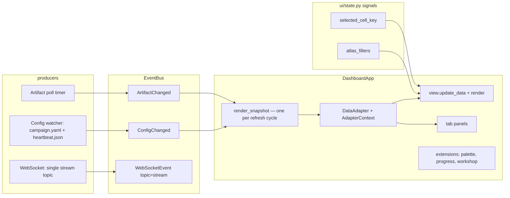

# Dashboard (`comp dashboard`)

A **read-only live window** over a continuous-discovery campaign root. Five
focused views give you the complete picture at a glance: **Monitor** (live
status + health + budget + activity), **Atlas** (discovery map + trade-offs +
objectives + gallery), **Defects** (defect funnel + maturation), **Evolution**
(probes + genome), **Evidence** (CEEC beliefs + claims + decisions). It polls
campaign artifacts and re-renders on change; it never writes to the campaign
root — actions route through the daemon lifecycle API and render disabled
with a tooltip when no `--daemon-url` is attached.

```bash
uv run comp dashboard --root artifacts/broad_map --port 8088
uv run comp dashboard --root artifacts/broad_map,artifacts/other  # multi-root
uv run comp dashboard --no-open --density compact                 # headless, compact
```

## Flags

| Flag | Default | Purpose |
|------|---------|---------|
| `--root` | `artifacts/broad_map` | Campaign root(s); **comma-separated paths** enable the header root selector |
| `--port` | `8088` | HTTP port |
| `--log-path` | newest `continuous*.log` | Ticker source (searches `<root>/logs/` then repo `logs/`) |
| `--poll` | `2.0` | Artifact polling interval (seconds) |
| `--daemon-url` | off | Lifecycle API base (e.g. `http://127.0.0.1:8940`) → live loss + live feed + enabled action buttons |
| `--no-open` | off | Do not open a browser tab (server/headless use) |
| `--density` | `comfortable` | `comfortable` \| `compact` (persisted; compact quiets the feed) |

One register, one density. Depth lives in each panel's "What am I looking at?"
drawer (plain → why → expert → docs). Progress (`b`) and workshop (`w`) are
always in the command palette.

## Views (5, nav-driven, hotkeys 1–5)

| Key | Label | Purpose |
|-----|-------|---------|
| `monitor` | Monitor | Liveness, health tiles, loss curve, budget burn-down, activity feed, driver intent |
| `atlas` | Atlas | Discovery map (UMAP + filterable table), Pareto trade-offs, parallel-coordinates objectives, figure gallery |
| `defects` | Defects | Defect funnel + constitution + lineage + episodes |
| `evolution` | Evolution | Probe analytics, stagnation, genome health, mutations, veto log |
| `evidence` | Evidence | CEEC beliefs, experiments, decisions (read-only; ledger writes stay in `ceec.run`) |

## Extensible Panels (via tabs / command palette / drawers)

### Monitor tabs
- **Activity Feed** — Live event stream
- **Field Reports** — Alerts and notifications
- **Budget** — Burn-down, cells/hour throughput, maturation counts, cost spread

### Atlas tabs
- **Trade-offs** — Pareto strip with objective-pair selector
- **Objectives** — Parallel coordinates over measured cells (axis picker up
  to 6, front highlighted, CSV + standalone-HTML export, inspect→forensics)
- **Campaigns** — Campaign card gallery
- **Preview** — Auto-evolve preview shelf
- **Regions** — Map region labels
- **Team** — Team wall with member progress

### Atlas drawer
- **Cell forensics** — Click a table row: coordinate, objectives, Pareto
  status, bursts/maturity, stability instruments, defect excerpts.
  Promote/unquarantine/deep-tier buttons are daemon-gated (disabled +
  tooltip without `--daemon-url`; the daemon has no per-cell endpoints yet,
  so they stay disabled until it does).
- **Filters** — Facet chips per recorded axis (dynamics/credit/update/
  topology), outcome, maturity, text search. Filters apply to the table;
  the map figure shows all cells.

### Defects tabs
- **Constitution** — System health invariants
- **Lineage** — Genome phylogeny viewer
- **Episodes** — Episode timeline

### Evolution tabs
- **Probes** — Probe batch metrics
- **Stagnation** — Diversity alerts
- **Genome** — Fitness history tracker
- **Mutations** — Mutation proposal explorer
- **Veto log** — Veto entry history

### Overlays (always available via palette)
- **Progress** — Badges/Quests/Records (modal, `b`)
- **Workshop** — Recipe editor (modal, `w`)

## Architecture



- **ViewRegistry** (`computronium/ui/view_registry.py`) — declarative
  registration of views and panels with plain labels; `PAGE | TAB | MODAL |
  DRAWER` placements, no mode or flag gating.
- **DataAdapter** (`computronium/ui/data_adapters.py`) — pure
  `adapt(AdapterContext) -> PanelData`; context carries `root`, one shared
  `DashboardSnapshot`, and the optional recognition store. Panels never do
  I/O and never poll.
- **Interaction state** (`computronium/ui/state.py`) — `selected_cell_key`
  and `atlas_filters` signals are the only push state (selection, filters,
  density, scrub cursor).
- **Stream** — one WebSocket topic `stream` with a typed envelope
  (`computronium/autoscientist/stream_protocol.py`); the daemon handshake
  negotiates the protocol version.
- **EventBus** (`computronium/ui/event_bus.py`) — sync/async pub/sub;
  `ArtifactChanged` carries `root` (foreign roots are dropped).
- **KB loads** are mtime-keyed cached; cell keys are canonical 4-part
  `dynamics|credit|update|topology`.
- **Observability**: `GET /metrics` (stdlib counters + reservoir summaries —
  `dashboard_snapshot_seconds`, `dashboard_adapter_seconds`,
  `dashboard_ws_events_total`).
- **Command Palette** — Cmd+K fuzzy search over all views, panels, and actions.
- **Deep Linking** — URL hash (`#view` or `#view/tab`) for shareable state.

## Extending

1. **Add a view** — add a `ViewSpec` to the registry in `computronium/ui/dashboard.py`
   with a factory returning a `BasePanel` and an optional `adapter_key`.
2. **Add a panel** — add a `PanelSpec` to a view's `tabs` or as a standalone modal/drawer.
3. **Add an adapter** — pure function `(DashboardSnapshot, root) -> dataclass`
   wrapped with `make_adapter`; register it in `ADAPTERS`
   (`computronium/ui/adapters.py`). Per-cell adapters (forensics) take a key
   resolved from `selected_cell_key` instead of joining `ADAPTERS`.
4. **Give the panel an `update_data`** — otherwise adapter payloads are
   dropped by the `BasePanel` no-op.
5. **Optional bus subscription** — `event_bus.subscribe(EventType, handler)`
   for live updates; publish on the bus instead of reaching into views.
6. **Optional story** — one module in `computronium/ui/stories/` rendering
   the panel standalone against a real root for visual development.

## Tests

| Lock | File |
|------|------|
| Views render populated + empty | `tests/ui/test_dashboard_render.py` |
| Interactions / WS routing | `tests/ui/test_dashboard_interactions.py` |
| Multi-root + hot-reload | `tests/ui/test_dashboard_state.py` |
| Row virtualization caps | `tests/ui/test_row_virtualization.py` |
| Adapter purity + determinism | `tests/unit/test_adapters.py` (+ `test_budget_evidence.py`, `test_forensics_filters.py`, `test_objective_export.py`) |
| EventBus delivery | `tests/property/test_ux_l16_eventbus_delivery.py` |

Screenshot generation is a manual dev workflow
(`scripts/generate_dashboard_screenshots.py`), not a CI gate.
