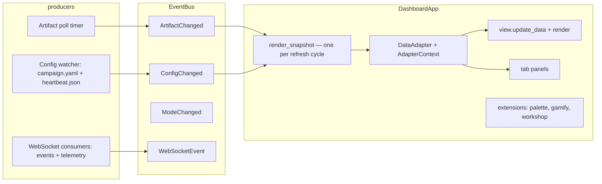

# Dashboard (`comp dashboard`)

A **read-only live window** over a continuous-discovery campaign root. Four
focused views give you the complete picture at a glance: **Monitor** (live
status + health + activity), **Atlas** (discovery map + trade-offs + gallery),
**Repair** (defect funnel + maturation), **Compose** (proven recipes + dial
composer). It polls campaign artifacts and re-renders on change; it never
executes code or writes to the ledger.

```bash
uv run comp dashboard --root artifacts/broad_map --port 8088
uv run comp dashboard --root artifacts/broad_map,artifacts/other  # multi-root
uv run comp dashboard --no-open --ui-mode lab                     # headless, lab copy
```

## Flags

| Flag | Default | Purpose |
|------|---------|---------|
| `--root` | `artifacts/broad_map` | Campaign root(s); **comma-separated paths** enable the header root selector |
| `--port` | `8088` | HTTP port |
| `--log-path` | newest `continuous*.log` | Ticker source (searches `<root>/logs/` then repo `logs/`) |
| `--poll` | `2.0` | Artifact polling interval (seconds) |
| `--daemon-url` | off | Lifecycle API base (e.g. `http://127.0.0.1:8940`) → live loss + live feed |
| `--no-open` | off | Do not open a browser tab (server/headless use) |
| `--ui-mode` | `auto` (`COMPUTRONIUM_UI_MODE`) | UI register: `explorer` (plain language) \| `lab` (technical) \| `auto` |
| `--ui-actions` | `off` (`COMPUTRONIUM_UI_ACTIONS`) | Enable Composer submit buttons (daemon wiring pending) |
| `--quiet` | off | Compact feed; hide ticker |
| `--gamify` | `off` (`COMPUTRONIUM_GAMIFY`) | Enable badges/quests/records overlay |

**Kill switches:** `--ui-actions off` (default), `--quiet`, `--gamify off`,
`COMPUTRONIUM_UI_MODE` / `COMPUTRONIUM_UI_ACTIONS` / `COMPUTRONIUM_GAMIFY` environment overrides.
The dashboard is strictly read-only with respect to campaign artifacts.

## Modes (registers)

- **Explorer** — plain-language copy, FK grade ≤ 8 (glossary-driven).
- **Lab** — technical copy (Pareto fronts, σ_max(J), burst strata).

The header mode toggle publishes `ModeChanged` on the event bus; the visible
view re-renders in place.

## Views (4, nav-driven)

| Key | Label | Icon | Purpose |
|-----|-------|------|---------|
| `monitor` | Monitor | 📊 | Live liveness, health tiles, loss curve, activity feed, driver intent, session delta |
| `atlas` | Atlas | 🗺 | Discovery map (UMAP + table toggle), Pareto trade-offs, figure gallery |
| `repair` | Repair | 🔧 | Defect funnel (status + copy unquarantine) + maturation tree |
| `compose` | Compose | 🎛 | Proven recipe cards → DialComposer with live validation → copy `comp campaign run` command |

## Extensible Panels (16, via tabs / command palette / overlays)

### Monitor tabs
- **Activity Feed** — Live event stream with pause/batch controls
- **Field Reports** — Alerts and notifications

### Atlas tabs
- **Trade-offs** — Pareto strip with objective-pair selector
- **Campaigns** — Campaign card gallery
- **Preview** — Auto-evolve preview shelf
- **Region Naming** — Map region label editor
- **Team** — Team wall with member progress

### Repair tabs (Lab only)
- **Constitution** — System health invariants
- **Lineage** — Genome phylogeny viewer
- **Episodes** — Episode timeline

### Compose tabs (Lab only)
- **Probe Analytics** — Probe batch metrics
- **Stagnation** — Diversity alerts
- **Genome Health** — Fitness history tracker
- **Mutations** — Mutation proposal explorer
- **Veto Log** — Veto entry history

### Overlays (conditional)
- **Progress** — Badges/Quests/Records (modal, `--gamify`)
- **Workshop** — Recipe editor (modal, `--ui-actions`)

## Architecture



- **ViewRegistry** (`computronium/ui/view_registry.py`) — declarative registration of views, panels, and extensions with visibility modes.
- **DataAdapter** (`computronium/ui/data_adapters.py`) — pure
  `adapt(AdapterContext) -> PanelData`; context carries `root`, one shared
  `DashboardSnapshot`, and the optional recognition store.
- **EventBus** (`computronium/ui/event_bus.py`) — sync/async pub/sub;
  `ArtifactChanged` carries `root` (foreign roots are dropped).
- **KB loads** are mtime-keyed cached; `pareto_top` is O(n log n) on
  2-objective fronts.
- **Observability**: `GET /metrics` (stdlib counters + reservoir summaries —
  `dashboard_snapshot_seconds`, `dashboard_adapter_seconds`,
  `dashboard_ws_events_total`).
- **Command Palette** — Cmd+K fuzzy search over all views, panels, and actions.
- **Deep Linking** — URL hash (`#view` or `#view/tab`) for shareable state.

## Extending

1. **Add a view** — add a `ViewSpec` to the registry in `computronium/ui/dashboard.py`
   with a factory returning a `BasePanel` and an optional `adapter_key`.
2. **Add a panel** — add a `PanelSpec` to a view's `tabs` or as a standalone modal/drawer/overlay.
3. **Add an adapter** — pure function `(DashboardSnapshot, root) -> dataclass`
   wrapped with `make_adapter`; register it in `ADAPTERS`
   (`computronium/ui/adapters.py`).
4. **Give the panel an `update_data`** — otherwise adapter payloads are
   dropped by the `BasePanel` no-op.
5. **Optional bus subscription** — `event_bus.subscribe(EventType, handler)`
   for live updates; publish on the bus instead of reaching into views.
6. **Glossary** — add explorer/lab strings to `computronium/ui/glossary.json`
   (`scripts/lint_readability.py` reports FK grades as informational —
   short technical labels are known heuristic false-positives, not a gate).

## Tests

| Lock | File |
|------|------|
| Views render populated + empty | `tests/ui/test_dashboard_render.py` |
| Interactions / WS routing | `tests/ui/test_dashboard_interactions.py` |
| D3 rebuild + X4 multi-root + X5 hot-reload | `tests/ui/test_dashboard_state.py` |
| Row virtualization caps | `tests/ui/test_row_virtualization.py` |
| Grayscale distinguishability (UX-L6) | `tests/ui/test_ux_l6_grayscale.py` |
| axe scan, 0 critical/serious (UX-L5/C4) | `tests/a11y/test_ux_l5_a11y.py` |
| Adapter equivalence (UX-L15) | `tests/property/test_ux_l15_adapter_equivalence.py` |
| EventBus delivery (UX-L16) | `tests/property/test_ux_l16_eventbus_delivery.py` |
| Performance budgets (D2) | `tests/perf/test_budgets.py` (by path — not in `testpaths`) |

NiceGUI `Screen` tests register pages **inside the test** (the plugin resets
routes between tests) and need `selenium` + the vendored
`tests/a11y/fixtures/axe.min.js`.

## Known Test Limitation

Running the full `tests/ui/` suite in one process can hit a NiceGUI shared-client
deletion cascade (fixtures like `screen` spin up a selenium server whose
teardown deletes the auto-index client, breaking later headless builds). The
fix is marker-based skip (`--capture-screenshots`) so selenium fixtures never
instantiate without the flag. Core tests (integration, property, adapter
equivalence) run in isolation and pass. For full UI suite, use `pytest -p no:nicegui`
or run test files separately.
