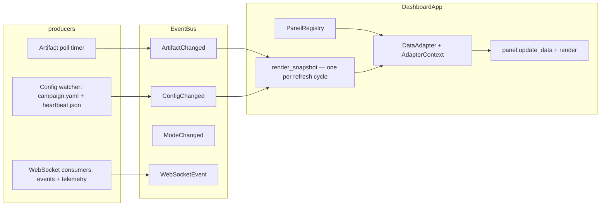

# Dashboard (`comp dashboard`)

A **read-only live window** over a continuous-discovery campaign root: living
atlas, defect funnel, health gauge, Pareto strip, burst-log ticker, and the
recognition layer (badges/quests/records). It polls campaign artifacts and
re-renders on change; it never executes code or writes to the ledger.

```bash
uv run comp dashboard --root artifacts/broad_map --port 8088
uv run comp dashboard --root artifacts/broad_map,artifacts/other  # multi-root
uv run comp dashboard --no-open --ui-mode lab --gamify off        # headless, lab copy
```

## Flags

| Flag | Default | Purpose |
|------|---------|---------|
| `--root` | `artifacts/broad_map` | Campaign root(s); **comma-separated paths** enable the header root selector |
| `--port` | `8088` | HTTP port |
| `--log-path` | newest `continuous*.log` | Ticker source (searches `<root>/logs/` then repo `logs/`) |
| `--poll` | `2.0` | Artifact polling interval (seconds) |
| `--daemon-url` | off | Lifecycle API base (e.g. `http://127.0.0.1:8940`) → Start/Pause/Stop bar + live badge |
| `--no-open` | off | Do not open a browser tab (server/headless use) |
| `--ui-mode` | `auto` (`COMPUTRONIUM_UI_MODE`) | UI register: `explorer` (plain language) \| `lab` (technical) \| `auto` |
| `--gamify` | `on` (`COMPUTRONIUM_GAMIFY`) | Recognition layer (badges, quests, records) |
| `--ui-actions` | `off` (`COMPUTRONIUM_UI_ACTIONS`) | Workshop / recipe-editor actions |
| `--rebuild-ui-state` | off | Replay the root's event log into `ui_state.sqlite` before first render |

**Kill switches:** `--gamify off`, `--ui-actions off` (defaults), and
`COMPUTRONIUM_UI_MODE` / `COMPUTRONIUM_GAMIFY` / `COMPUTRONIUM_UI_ACTIONS`
environment overrides. The dashboard is strictly read-only with respect to
campaign artifacts.

## Modes (registers)

- **Explorer** — plain-language copy, FK grade ≤ 8 (glossary-driven).
- **Lab** — technical copy (Pareto fronts, σ_max(J), burst strata).

The header mode toggle publishes `ModeChanged` on the event bus; the drawer
and current panel re-render in place. Lab-only panels hide in Explorer.

## Panels (20, registry-driven)

| # | Key | Label | Visible |
|---|-----|-------|---------|
| 0 | `discovery_map` | Atlas map + table alternative | both |
| 1 | `tradeoffs` | Pareto trade-offs | both |
| 2 | `repair_bench` | Defect funnel | both |
| 3 | `health` | Health gauge + loss curve | both |
| 4 | `campaigns` | Campaign cards | both |
| 5 | `preview` | Preview shelf | both |
| 6 | `region_naming` | Region labels | both |
| 7 | `team` | Team wall | both |
| 8 | `activity_feed` | Live event feed | both |
| 9 | `field_reports` | Field reports | both |
| 10 | `constitution` | Constitution health | lab |
| 11 | `lineage` | Lineage viewer | lab |
| 12 | `episodes` | Episode timeline | lab |
| 13 | `progress` | Badges / quests / records | gamify on |
| 14 | `workshop` | Workshop actions | `--ui-actions on` |
| 15 | `probe_analytics` | Probe analytics | lab |
| 16 | `stagnation` | Stagnation dashboard | lab |
| 17 | `genome_health` | Genome health | lab |
| 18 | `mutations` | Mutation explorer | lab |
| 19 | `veto_log` | Veto log | lab |

Large tables cap at `MAX_RENDERED_ROWS` (1000) with a "showing first rows"
caption (`showing_first` glossary key).

## Architecture



- **PanelRegistry** (`computronium/ui/panel_registry.py`) — nav + factories.
- **DataAdapter** (`computronium/ui/data_adapters.py`) — pure
  `adapt(AdapterContext) -> PanelData`; context carries `root`, one shared
  `DashboardSnapshot`, and the optional recognition store.
- **EventBus** (`computronium/ui/event_bus.py`) — sync/async pub/sub;
  `ArtifactChanged` carries `root` (foreign roots are dropped).
- **KB loads** are mtime-keyed cached (`kb_load_cached`); `pareto_top` is
  O(n log n) on 2-objective fronts.
- **Observability**: `GET /metrics` (stdlib counters + reservoir summaries —
  `dashboard_snapshot_seconds`, `dashboard_adapter_seconds`,
  `dashboard_render_panel_seconds`, `dashboard_ws_events_total`).

## Extending

1. **Register a panel** — `panel_registry.register(key, label_key, icon,
   factory=..., adapter=..., order=..., visible_predicate=...)` (see
   `_register_panels()` in `computronium/ui/dashboard.py`).
2. **Add an adapter** — pure function `(DashboardSnapshot, root) -> dataclass`
   wrapped with `make_adapter`, or `make_context_adapter` when you need the
   recognition store; register it in `ADAPTERS`
   (`computronium/ui/adapters.py`).
3. **Give the panel an `update_data`** — otherwise adapter payloads are
   dropped by the `BasePanel` no-op.
4. **Optional bus subscription** — `event_bus.subscribe(EventType, handler)`
   for live updates; publish on the bus instead of reaching into panels.
5. **Glossary** — add explorer/lab strings to `computronium/ui/glossary.json`
   (Explorer copy must pass FK grade ≤ 8: `scripts/lint_readability.py`).

## Tests

| Lock | File |
|------|------|
| Panels render populated + empty | `tests/ui/test_dashboard_render.py` |
| Interactions / WS routing | `tests/ui/test_dashboard_interactions.py` |
| D3 rebuild + X4 multi-root + X5 hot-reload | `tests/ui/test_dashboard_state.py` |
| Row virtualization caps | `tests/ui/test_row_virtualization.py` |
| Grayscale distinguishability (UX-L6) | `tests/ui/test_ux_l6_grayscale.py` |
| axe scan, 0 critical/serious (UX-L5/C4) | `tests/a11y/test_ux_l5_a11y.py` |
| Adapter equivalence (UX-L15) | `tests/property/test_ux_l15_adapter_equivalence.py` |
| EventBus delivery (UX-L16) | `tests/property/test_ux_l16_eventbus_delivery.py` |
| Performance budgets (D2) | `tests/perf/test_budgets.py` (by path — not in `testpaths`) |

NiceGUI `Screen` tests register pages **inside the test** (the plugin resets
routes between tests) and need `selenium` + the vendored
`tests/a11y/fixtures/axe.min.js`.
