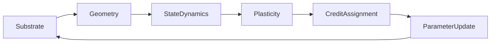

## ML Library Capabilities

| Capability | Description |
|------------|-------------|
| **Composable systems** | Construct any 6-axis system coordinate via the `System` generic or factory functions (5-D systems are the `P = NullPlasticity` slice) |
| **Common training API** | `SystemTrainer` — single interface for all learning rules, including joint systems via duck-typed `train_step`/`forward` |
| **Multiple learning rules** | Backprop, EqProp, FA, DFA, Forward-Forward, PEPITA, Target Prop, Predictive Coding, Hebbian/STDP, SNN, TileNet, 6-D joint (Routing, FastWeight) — credit swap demonstrated live |
| **Substrate models** | Digital, Memristive (IR-drop), Neuromorphic (spikes), Photonic (phase), Quantum (unitary) |
| **Benchmarks & ablations** | 5-level hierarchy: adaptation, compute efficiency, structural robustness, algorithm migration, Z3 fixed-weights |
| **Stability / energy analysis** | Spectral radius, Lyapunov exponents, settling time, basin stability, free-energy tracking; frozen-θ lifecycle guarantee |
| **Multi-objective discovery** | `comp run` profiles with multi-objective config — configurable Pareto fronts across objectives (accuracy, walltime, params, FLOPs, memory, energy, latency, spectral radius, Lyapunov, ψ capacity, credit alignment, ruler-relative); objective-aware driver, multi-objective promotion (L1/L2) |
| **EMA harvest** (`SystemTrainerConfig.harvest_mode`) | Probe-free streaming-weight harvest instrument; resurrected depth-50 (0.784→0.917) |
| **Recipe cards** (`recipe_cards.py`) | Credit×Update→optimizer/geometry/config canonical-constructor registry |
| **I(C,U) predictive model** (`fit_icu_model.py`, `icu_report.py`) | Learnability-interaction law with 0.944 held-out lattice accuracy |
| **Frozen-θ ψ benchmarks** (L1/L2/L3/L3.5, `psi_engaged`) | Frozen-θ ψ-only adaptation, recovery, and migration with θ bitwise-invariance audits |
| **P-axis expressiveness probes** | Fixed-θ ψ mechanisms verified at probe scale: Kolmogorov compression (short ψ unfolds 32×32 patterns, 2.66× ratio), NCA rule reconfiguration (K distinct patterns from one seed, θ SHA-invariant, 3 seeds), sequential composition over NTM tape (max/sum/median at O(1) depth); σ_max(J_F) stability-expressiveness frontier measured. Deep chaotic unfolding (E1) falsified with a mechanism boundary — composition-error compounding |
| **I(C,U) ψ-orthogonality** | 3-seed measurement of ψ modulation on the credit×update surface: across tested configurations, observed ψ modulation averaged 2.0 percentage points (max 9.1 points, fa×muon routing). These measurements do not establish equivalence or negligibility; campaign-7.1 rows in `data/icu_measurements.csv`, `logs/w17_icu_fit.log` |
| **Experiment sweeps / campaigns** | `comp run` / `comp benchmark` — structured hypercube exploration |
| **Distributed execution / deployment** | P2P (gRPC/Kademlia), multi-GPU (DDP/FSDP/DeepSpeed), ONNX/TorchScript/INT8/ternary export, FastAPI inference server |

---

### Architecture Diagram



**Schematic Coupling Diagram** — arrows denote *data flow through the ontology*, not execution order. The cyclic `U → S` edge represents physical state updates (parameter consolidation altering substrate state, e.g. memristive conductance), not a strict sequential pipeline.

<details>
<summary><strong>Why U → S cyclic dependency?</strong> ⋯</summary>

The cyclic dependency (U → S) reflects that parameter updates can alter substrate state (e.g., memristive conductance drift, weight quantization), which in turn affects subsequent forward passes. This is modeled explicitly in the joint transition operator.
</details>

---

### Algebraic Composition (API)

Construct systems by composing primitives across the six axes. The `System` generic and the `compose_*` factories catch invalid combinations at type-check time.

**One trainer, every credit rule** — the same coordinate trained through byte-identical wiring with a single swapped constructor argument. The block is locked verbatim against its source demo test ([`tests/integration/test_demo_swap_credit.py`](tests/integration/test_demo_swap_credit.py)); all three arms learn:

<!-- lock: swap_credit -->
```python
import torch

from computronium import (
    BackpropCredit,
    DigitalSubstrate,
    EnergyMinimizationDynamics,
    EuclideanUpdate,
    GeometryConfig,
    NullPlasticity,
    ParameterUpdateConfig,
    RandomProjectionsCredit,
    RecurrentGeometry,
    StateDynamicsConfig,
    SubstrateConfig,
    SystemTrainer,
    SystemTrainerConfig,
    ThermodynamicContrast,
    compose_joint_system,
    create_task,
)

CREDIT_ARMS = (
    ("gradient", BackpropCredit()),
    ("thermodynamic_contrast", ThermodynamicContrast()),
    ("random_projections", RandomProjectionsCredit()),
)


def _flatten(loader):
    for x, y in loader:
        yield x.view(x.size(0), -1), y


task = create_task("mnist", device="cpu", quick_mode=True)
task.setup()
train_loader = task.get_dataloader("train")
config = SystemTrainerConfig(max_epochs=1, device="cpu", seed=42)
for name, credit in CREDIT_ARMS:
    torch.manual_seed(0)
    system = compose_joint_system(
        substrate=DigitalSubstrate(SubstrateConfig.digital(device="cpu")),
        geometry=RecurrentGeometry(
            GeometryConfig.recurrent(
                input_dim=784, output_dim=10, hidden_dims=(32,)
            )
        ),
        dynamics=EnergyMinimizationDynamics(
            StateDynamicsConfig.energy_minimization(max_steps=3, beta=0.5)
        ),
        plasticity=NullPlasticity(),
        credit=credit,  # the one swapped argument
        update=EuclideanUpdate(ParameterUpdateConfig.euclidean(step_size=0.1)),
    )
    metrics = SystemTrainer(
        system=system, config=config, train_data=_flatten(train_loader)
    ).fit()[-1]
    print(f"{name}: {metrics['train_acc']:.1%}")
```
<details>
<summary><strong>Credit-swap demo explained</strong> ⋯</summary>

The credit-swap demo demonstrates that Backprop (global gradient), ThermodynamicContrast (energy-based local contrast), and RandomProjections (fixed random feedback) can all train the same recurrent geometry with only the credit constructor argument changed. This is the compositional abstraction in action: the geometry, dynamics, substrate, plasticity, and update remain identical.
</details>

<details>
<summary><strong>P-axis swaps work the same way</strong> ⋯</summary>

Pass `RoutingPlasticity(...)` / `FastWeightPlasticity(...)` / `SubstrateCoupledPlasticity(...)` (see [Plasticity](#-plasticity-metadynamics) in the axis table) as the `plasticity` argument of `compose_joint_system` — the null swap that retains what `NullPlasticity` forgets is demonstrated in `test_demo_swap_plasticity.py`.
</details>

<details>
<summary><strong>Formerly hardcoded model families → coordinates</strong> ⋯</summary>

Formerly hardcoded model families (`optical_looped_mlp`, `quantized_looped_mlp`, `crossbar_looped_mlp`, `eqprop_transformer`, `neural_cube`, `sparse_equilibrium`, `momentum_equilibrium`, TileNet variants) are now **expressed as coordinates/compositions** in this 6-axis space. These 5-D systems are recovered as the `M = NullPlasticity` slice.
</details>

---

### Research Direction Models (Experimental Variants)

These are native implementations of research directions and experimental variants expressed as first-class ontology coordinates. Several may overlap prior literature:

| Model | Coordinate | Description |
|-------|------------|-------------|
| `holomorphic_ep` | `QuantumSubstrate × RecurrentGeometry × EnergyMinimization × ThermodynamicContrast × EuclideanUpdate` | Complex-valued Equilibrium Propagation using holomorphic (analytic) activation functions and conjugate-transpose feedback pathways — complex-valued, not quantum: the quantum label applies only when running on the specific simulated unitary-gate substrate. Enables complex-domain credit assignment with potential for phase-based computation. |
| `directed_ep` | `DigitalSubstrate × RecurrentGeometry × EnergyMinimization × RandomProjections × EuclideanUpdate` | Directed/Asymmetric Equilibrium Propagation implementing Feedback Alignment within energy-based framework. Fixed random feedback matrices (no transport shortcut; FA is legitimate here — feedback is a fixed random matrix, not a transpose) with thermodynamic settling dynamics. |
| `finite_nudge_ep` | `DigitalSubstrate × RecurrentGeometry × EnergyMinimization × ThermodynamicContrast(beta≥1) × EuclideanUpdate` | Finite-Nudge Equilibrium Propagation using large β (finite nudge) instead of infinitesimal limit. Stronger supervision signals while maintaining equilibrium dynamics. |
| `ternary_eqprop` | `TernarySubstrate × RecurrentGeometry × EnergyMinimization × ThermodynamicContrast × EuclideanUpdate` | Ternary-weight Equilibrium Propagation with STE-based quantization. Weights constrained to {-α, 0, +α}. |
| `momentum_eqprop` | `DigitalSubstrate × RecurrentGeometry × EnergyMinimization(momentum) × ThermodynamicContrast × EuclideanUpdate` | Heavy-ball settling dynamics for faster equilibrium convergence. |
| `sparse_eqprop` | `SparseSubstrate × RecurrentGeometry × EnergyMinimization × ThermodynamicContrast × EuclideanUpdate` | Dynamic sparsity masks with efficient sparse matmul. |
| `diffusion_eqprop` | `DigitalSubstrate × RecurrentGeometry × DiffusionDynamics × ThermodynamicContrast × EuclideanUpdate` | Continuous-time diffusion settling dynamics. |

These models are available via the native API in `computronium.models.native`:

```python
from computronium.models.native import (
    create_native_holomorphic_ep,
    create_native_directed_ep,
    create_native_finite_nudge_ep,
    create_native_ternary_eqprop,
    create_native_momentum_eqprop,
    create_native_sparse_eqprop,
    create_native_diffusion_eqprop,
)
```

<details>
<summary><strong>Not claimed as novel algorithms</strong> ⋯</summary>

These models are not claimed as novel algorithms; they are *framework-native expressions* of research directions that can be systematically compared, ablated, and extended within the 6-axis ontology. The framework contribution is their common compositional representation and systematic comparison infrastructure.
</details>

---

## 🧬 Coupled Dynamical Systems

Historically, ML frameworks treat models as static computational graphs. Computronium treats them as **coupled dynamical systems**.

Computronium provides the ontology, infrastructure, and automation tooling used to investigate **limits imposed by stability, locality, and resource constraints**.

<details>
<summary><strong>Joint transition operator</strong> ⋯</summary>

By elevating the computational rule to a dynamical variable, we introduce a **joint transition operator** $z_{t+1} = F_{\theta_e}(z_t, u_t, \xi_t, \Delta t_t; G, S, D, P)$ unifying fast neural activity, inputs $u_t$, stochastic contributions $\xi_t$, elapsed time $\Delta t_t$, slow synaptic consolidation, and substrate physics. Existing 5-D learning systems are represented as the `M = NullPlasticity` slice of this joint 6-D formulation. The representation is substrate-aware; that does not by itself make any particular algorithm a physical process.
</details>

<details>
<summary><strong>Frozen-θ contract (Boundary Invariance, Stage-Boundary Invariance)</strong> ⋯</summary>

Within an episode, persistent θ is invariant: `FrozenThetaAudit`
(`computronium.core.frozen_theta`) snapshots geometry parameters,
substrate state tensors, and optimizer parameter groups at entry and
detects at exit — via clones, `Tensor._version` counters, and
`data_ptr()` — **in-place mutations**, *mutate-then-restore* (version
bumps survive a `copy_` rollback), **alias mutations**, and **storage
rebinding** (including added/removed tensors). Violations raise
`FrozenThetaError(AssertionError)`. This is enforced empirically
(`tests/property/joint/test_frozen_theta_audit.py`, adversarial suite)
— a sampled-numerical guard (Level 4), not a Level 1–3 derivation.
</details>

<details>
<summary><strong>P-axis: architectural capabilities (not a validated expressiveness capability)</strong> ⋯</summary>

The P-axis (ψ) provides **architectural** benefits independent of
benchmark performance: lifecycle control (ψ as a first-class dynamical
variable), intervention (frozen-θ ψ-only adaptation with bitwise θ
audits), and explicit routing (state-dependent gating over the NTM
tape or NCA fabric — the program becomes writable data on fixed
hardware θ). Whether ψ-mediated mechanisms outperform standard
recurrent memory on benchmarks remains an open empirical question;
the E-probes below report what was measured at probe scale.
</details>

<details>
<summary><strong>E-probe results (probe-scale evidence, not validated headline claims)</strong> ⋯</summary>

Compression (E2), fabric reconfiguration (E3), and program sequencing
over a tape (E4) are demonstrated at probe scale with frozen θ. Deep
*chaotic* unfolding (E1) is **falsified** with a recorded mechanism
boundary: under this architecture and precision, short-horizon local
learning failed to achieve the one-step accuracy needed for reliable
long-horizon rollout due to composition-error compounding (local
credit of fixed horizon T cannot control N-step composition error
unless T scales with N). A σ_max(J_F) stability–expressiveness
frontier on the NCA fabric is measured: most patterns cost nothing;
thin symmetric structure requires non-contractive rules.
</details>

<details>
<summary><strong>Campaign first records (probe-scale evidence, not validated headline claims)</strong> ⋯</summary>

**Credit × Update mechanistic study** (12 cells × 3 seeds, one-step
reset-state + 30-step trajectory arms, norm-matched): Muon gave the
best immediate transformation quality (eqprop×muon +0.324 vs euclidean
+0.221); the BP reference has the highest descent quality (+0.589) at
the smallest displacement; lemma cells measured near-inert at matched
norms. Records: `results/mechanistic_study/claim_record.json`.

**Stability × Memory campaign** (648 cells × 3 seeds × 8 trials,
store–delay–recall with contraction {0.5, 0.9, 1.05} × gate
{selective, ungated} × coupling {open, coupled} × precision {f32, f16,
bf16} × noise {0, 0.1} × readout {full, low-rank, 4-bit} × delay
{1, 8, 32}): selective (cue-gated) memory retains ≈ 1.0 at every
measured contraction rate and every delay, while ungated memory
collapses with distractor count (≈ 0.08 at delay 32). Feedback
coupling (memory into the state block) lowers the measured perturbation
decay but leaves retention unchanged — retention reads the memory
block only; the state-arm noise effect is reported separately as
`state_noise_divergence`. Records: `results/memory_stability/
claim_record.json`; scatter extraction via
`retention_contraction_scatter`. Both campaigns are Level 4 (sampled
numerical) / Level 5 (empirical).
</details>

---

## ⚡ Energy, Stability, and Dynamical Invariants

Energy binds Geometry and StateDynamics. The framework elevates the energy function `E(x)` to a first-class object, enabling mathematical stability analysis *before* implementation:

<details>
<summary><strong>Stability claims, stated at their actual strength</strong> ⋯</summary>

**Symmetric topology + EnergyMinimization**: under documented regularity and discretization assumptions, the specified dynamics admit a Lyapunov argument; convergence to an equilibrium depends on additional conditions stated per implementation (property-locked, Level 4). **Directed topology** → requires a Control-Lyapunov formulation (certified numerically for PredictiveSettlingDynamics). **Free energy tracking** → per-iteration Lyapunov certificates (`track_free_energy_per_iter`) for predictive coding and directed FA — Level 4 sampled numerical, consistent-with-descent, never proof.

**Stability metrics are explicitly separated**: the Asymptotic Stability Margin is the spectral radius $\rho(J_F)$ (via `spectral_radius_from_jacobian`); the Transient Amplification Bound is $\|J_F\|_2$ (via `dominant_singular_value`). These are different quantities on nonnormal Jacobians; `estimate_directional_amplification` measures finite-difference growth along probed directions and certifies neither $\rho$ nor $\sigma_{\max}$. Older materials quoting the estimator as "ρ(J)" are flagged `requires_rerun` in `docs/CORRECTIONS.md`.
</details>

### Verification Taxonomy

All claims in this repository are labeled by the 5-level taxonomy
(`computronium.verification`), enforced by `tests/property/test_verification_labels.py`:

| Level | Name | Meaning |
|:-----:|------|---------|
| 1 | Analytical | Pen-and-paper derivation |
| 2 | Machine-checked | Proof assistant / solver certificate |
| 3 | Certified numerical | Rigorous bound (interval arithmetic etc.) |
| 4 | Sampled numerical | Property tests, finite-difference checks, seeds |
| 5 | Empirical | Observed behavior, no bound |

The CI gate relies primarily on **Level 4** (sampled numerical) and **Level 5** (empirical). No CI test confers Level 1–3 status; wording that says otherwise is a defect.

<details>
<summary><strong>Joint dynamics extension</strong> ⋯</summary>

The joint extension of these dynamics — composite state $z_t = (x_t, \psi_t, \sigma_t)$, lifecycle registry, episode-boundary consolidation — is specified once in *Core Architecture* below. Campaign tooling treats the **stability-plasticity trade-off** and resource constraints as explicit search constraints rather than afterthoughts; the **experiment kernel** searches the declared ontology space and records experiment results.
</details>