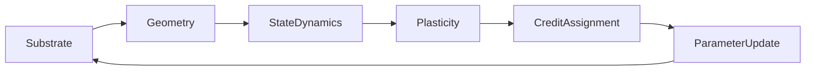

## The 6-axis ontology

**Computronium models learning systems using 6 composable axes:**

```
System = Substrate × Geometry × StateDynamics × Plasticity × CreditAssignment × ParameterUpdate
```

A **System is a 6-axis coordinate; 5-D systems are the `P = NullPlasticity` subspace.** This decomposition is the framework's organizing abstraction for comparing learning systems. The space is a **compatibility-constrained subset** of the full Cartesian product — `SystemConfig.validate()` whitelists compatible combinations of primitives; the compatible region is the kernel's search space. The ontology is a design abstraction, not an established law of computation.

| Axis | Symbol | Role | Primitives |
|------|:------:|------|------------|
| **🔩 Substrate** | $S$ | Physical state space: precision, noise, sparsity constraints | `Digital`, `Memristive` (conductance, IR-drop), `Neuromorphic` (async spikes), `Photonic` (phase/amplitude), `Quantum` (unitary gates), `Noisy`, `Complex`, `Sparse`, `Ternary` |
| **🔷 Geometry** | $G$ | Topology & routing of computational units | `FeedforwardDAG` (MLP/CNN), `RecurrentAttractor` (Hopfield/EqProp), `TileMesh` (TileNet), `FabricPC` (arbitrary node-edge), `SpatialLattice3D` (neural_cube), `NTM` (external-memory tape: controller + content-addressed read/write heads), `NCA` (neural cellular automaton: emergent spatial fabric) |
| **🌀 StateDynamics** | $D$ | Forward evolution & settling (the "forward pass") | `EnergyMinimization` (EqProp), `PredictiveSettling` (Predictive Coding), `SpikeIntegration` (LIF/Izhikevich), `InstantaneousPass` (FF/Backprop), `LazyStateDynamics` (on-demand activation), `Diffusion` |
| **🧬 Plasticity (MetaDynamics)** | $P$ | Mechanism elevating the computational rule to a dynamical variable. With external memory (NTM) and emergent substrates (NCA), the program becomes data that can be written, composed, and sequenced on fixed hardware (θ): reconfigurable program (ψ), unbounded tape (NTM memory). P-axis provides *architectural* benefits (lifecycle control, intervention, explicit routing); whether it outperforms standard recurrent memory on benchmarks is an open empirical question | `NullPlasticity` (Zero-Extension), `RoutingPlasticity` (gating/rerouting), `FastWeightPlasticity` (episode-local memory), `SubstrateCoupledPlasticity` (physical plasticity), `RuleStatePlasticity` (Z3: rule selection), `ClosedFormRidgePlasticity` (supervised ψ computed, not trained), `TemporalPsiPlasticity` (trace-decayed supervised ψ — forgetting enables task migration on frozen θ) |
| **💡 CreditAssignment** | $C$ | Error routing & pseudo-gradient computation | `ThermodynamicContrast` (EqProp free/nudged), `RandomProjectionsCredit` (FA/DFA), `LocalGoodnessCredit` (Forward-Forward/PEPITA), `TemporalTraceCredit` (STDP), `TargetInversionCredit` (Target Prop), `HomeostaticCredit` (autonomous Lipschitz scaling) |
| **🔧 ParameterUpdate** | $U$ | Slow, persistent parameter consolidation Δθ | `EuclideanUpdate` (SGD/Adam), `RiemannianOrthogonalUpdate` (Muon), `SpectralConstrainedUpdate`, `NaturalGradientUpdate` (Fisher), `ElasticConsolidationUpdate` (EWC) |

### Substrate Specifications

<details>
<summary><strong>SubstrateSpec: substrates as structured specifications, not string tags</strong> ⋯</summary>

A substrate is defined by an execution model, a device model, a numeric representation, noise, constraints, and cost — captured by the frozen `SubstrateSpec` dataclass (`computronium/ontology/substrate/spec.py`) with `make_substrate(spec)` as its factory. Specs compose: "noisy, sparse, complex-valued" is one spec with three facets. `SubstrateSpec.from_config`/`to_config` round-trip all legacy `SubstrateConfig` presets losslessly (including the ternary/complex/sparse digital family, which legacy configs cannot distinguish from fields alone — new code should construct specs directly).
</details>

### Geometry Primitives

<details>
<summary><strong>NTM Geometry (`NtmGeometry`, `GeometryConfig.ntm`)</strong> ⋯</summary>

External-memory tape: LSTM controller + content-addressed heads; local credit learns copy via memory (0.958 @8000 steps, 3 seeds) — TODO.ntm_nca §11.14
</details>

<details>
<summary><strong>NCA Geometry (`NcaGeometry`, `GeometryConfig.nca`)</strong> ⋯</summary>

Neural cellular automaton fabric; local credit solves growing NCA (fg 1.000, 3 seeds) — TODO.ntm_nca §11.8
</details>

### CreditAssignment Primitives

<details>
<summary><strong>PEPITA / LEMMA Credit (`PepitaCredit`, `local_objective="lemma"`)</strong> ⋯</summary>

Published PEPITA input-modulation credit (BP parity 0.884) and the naming distinction from per-layer closed-form LEMMA — TODO15 §11.1/§11.2
</details>

### Algorithm Identity Cards

Every Credit, Update, and Plasticity primitive carries an
`AlgorithmIdentityCard` class attribute: reference equation, deviations
from the literature, the pseudo-gradient definition, validated limits,
and its verification level. Rendered cards live in
[`docs/IDENTITY_CARDS.md`](docs/IDENTITY_CARDS.md); the generator
(`scripts/generate_identity_cards.py --strict`) is wired into
pre-commit (C.1) and fails when a concrete primitive ships without
one.

---

### Architecture Diagram



**Schematic Coupling Diagram** — arrows denote *data flow through the
ontology*, not execution order. The cyclic `U → S` edge represents
physical state updates (parameter consolidation altering substrate
state, e.g. memristive conductance), not a strict sequential pipeline.

<details>
<summary><strong>Why U → S cyclic dependency?</strong> ⋯</summary>

The cyclic dependency (U → S) reflects that parameter updates can alter substrate state (e.g., memristive conductance drift, weight quantization), which in turn affects subsequent forward passes. This is modeled explicitly in the joint transition operator.
</details>

---
